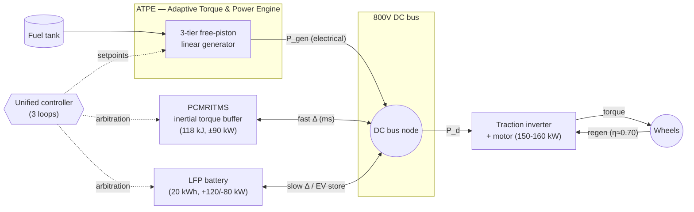
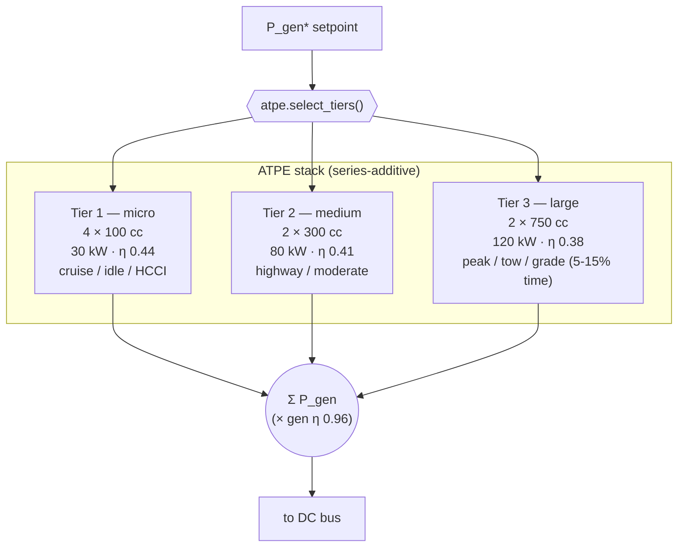
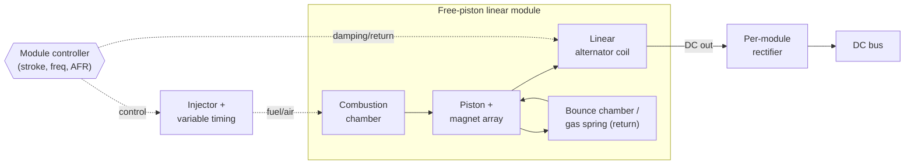
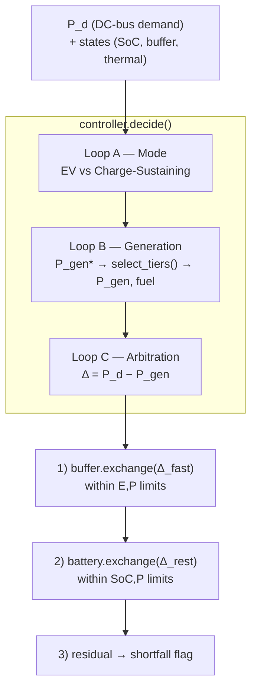
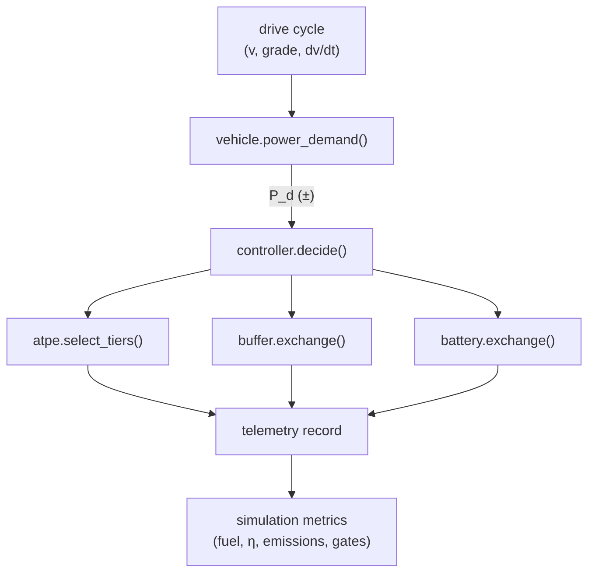

# Architecture Diagrams

In-repo, version-controllable diagrams of the Project Phoenix powertrain. These are
**conceptual/architecture** diagrams (Mermaid), not mechanical CAD — they describe how the
subsystems connect and how power and control signals flow. They mirror the parameters in
[../digital_twin/config.py](../digital_twin/config.py) and the design in
[08-digital-twin-design.md](08-digital-twin-design.md).

> Scope note: real mechanical CAD (Gate 7 in [09-atpe-ers-and-insights.md](09-atpe-ers-and-insights.md))
> and FEA come later with dedicated tools. See [§ Engine & Cylinder Design Approach](#engine--cylinder-design-approach)
> below for how the physical engine, cylinders, and the "torque converter" question are handled.

---

## 1. System Block Diagram (series-hybrid power flow)

The architecture is a **series hybrid**: combustion never touches the wheels mechanically.
The ATPE generates electricity, everything meets on a shared DC bus, and a traction motor
drives the wheels. **There is no torque converter and no crankshaft** — see the design note below.



---

## 2. ATPE Three-Tier Cylinder Stack

Additive tiers: the controller activates the smallest combination that meets demand at the best
BSFC. Values are the Phase-1 config in [`_phase1_powertrain()`](../digital_twin/config.py).



---

## 3. Free-Piston Cylinder Module (conceptual cross-section)

One self-contained, hot-swappable module. No crankshaft, no camshaft — the piston oscillates
linearly and a linear alternator extracts power directly. Stroke and frequency are
electronically variable (Atkinson-like expansion on demand).



---

## 4. PCMRITMS Multi-Ring Rotor Layout

Phase-coordinated rotors form a bounded kinetic reservoir that brokers millisecond power swings
the free-piston generator cannot ramp into. Values per the whitepaper sizing
([10-pcmritms-whitepaper-spec.md](10-pcmritms-whitepaper-spec.md), [11-pcmritms-twin-alignment.md](11-pcmritms-twin-alignment.md)).

```mermaid
flowchart TB
    subgraph PACK["PCMRITMS pack — 118 kJ @ ~800 rad/s"]
        direction LR
        R1["Rotor 1<br/>I=0.12 kg·m²<br/>MG ~30 kW"]
        R2["Rotor 2<br/>I=0.15 kg·m²<br/>MG ~30 kW"]
        R3["Rotor 3<br/>I=0.10 kg·m²<br/>MG ~30 kW"]
    end
    R1 --> Sum(("Epicyclic<br/>torque summing<br/>(Option A)"))
    R2 --> Sum
    R3 --> Sum
    Sum -- "phase-coordinated surge<br/>(+35-50%, 0.2-0.5 s)" --> Out["Buffer ↔ DC bus<br/>(±90 kW cont.)"]
    Phase{{"Phase controller"}} -. "relative phase" .-> R1
    Phase -. .-> R2
    Phase -. .-> R3
```

> Expandable to 4-6 rotors. Round-trip efficiency target 75-85% (twin uses 0.80). The optional
> brief-burst rating is derived in [pcmritms_coupling.py](../digital_twin/pcmritms_coupling.py).

---

## 5. Unified Controller — Three Loops

Mirrors [`controller.decide()`](../digital_twin/controller.py) and the data flow in
[08-digital-twin-design.md](08-digital-twin-design.md).



---

## 6. Per-Timestep Data Flow



---

## Engine & Cylinder Design Approach

This answers the natural follow-up: *how do we design the actual engine, the cylinders, and the
"torque converter"?*

### There is no torque converter (by design)
A torque converter is a fluid coupling for a **mechanically-connected** ICE + automatic
transmission. Phoenix is a **series hybrid**: the engine spins no driveshaft. Torque to the
wheels comes entirely from the electric traction motor (flat torque from 0 rpm), and the role a
torque converter would play — smoothing/multiplying torque during transients — is filled by the
**PCMRITMS inertial buffer** (electrically, in milliseconds). So "torque converter design" maps
onto **PCMRITMS rotor + power-electronics design**, not a hydrodynamic coupling.

### Design layers and the tool for each

| Layer | What we design | Tool / method | Status |
|-------|----------------|---------------|--------|
| System behaviour | tier sizing, power split, control law, drive-cycle outcomes | **Python twin (this repo)** | done / ongoing |
| Architecture diagrams | block / stack / rotor / control topology | **Mermaid (this file)** | done |
| Combustion & gas exchange | bore/stroke, compression ratio, HCCI/lean limits, BSFC map per tier | 1-D engine + chemistry: **Cantera (Python)** → GT-Power / Ricardo WAVE | backlog (Gates 1-2) |
| Free-piston dynamics | piston mass, bounce-chamber spring rate, resonant frequency, stroke control stability | spring-mass-damper + combustion forcing model (Python first), then co-sim | backlog (Gate 2) |
| Linear alternator | magnet/coil geometry, force constant, electrical η, cogging | electromagnetic **FEA: FEMM (open) → Ansys Maxwell** | backlog (Gate 3) |
| Rotor structural | ring stress at 800 rad/s, burst margin, magnetic-bearing loads | structural **FEA: Ansys Mechanical** | backlog (PCMRITMS validation) |
| Mechanical CAD | physical parts, packaging, tolerances, STEP for manufacture | **FreeCAD (open, Python-scriptable) → SolidWorks/Fusion** | Gate 7 |

### Recommended path for the cylinder/engine model specifically
1. **Stay parametric in Python first.** Add a per-tier BSFC map and a free-piston dynamics model
   (mass-spring + combustion forcing) inside `digital_twin/` so the twin's abstracted Gates 1-2
   become real physics — no new tooling, fully testable, version-controlled.
2. **Validate combustion with Cantera** (pure-Python chemistry) before reaching for licensed
   GT-Power/WAVE. It fits the repo's zero-dependency philosophy as an optional study, like
   `ml_study/`.
3. **Hand geometry to FEA only when a number needs it** — alternator force constant (FEMM/Maxwell)
   and ring burst margin (Ansys). These feed *parameters* back into the Python twin; the twin
   stays the system-of-record.
4. **CAD last (Gate 7).** Use FreeCAD's Python API so cylinder/rotor geometry is generated from
   the same config dataclasses, keeping one source of truth from simulation → drawing.

> Principle: **Python twin is the single source of truth.** Specialist tools (Cantera, FEMM,
> Ansys, FreeCAD) produce parameters or geometry that flow *into* it — we do not fork the model
> into MATLAB/Simulink.
